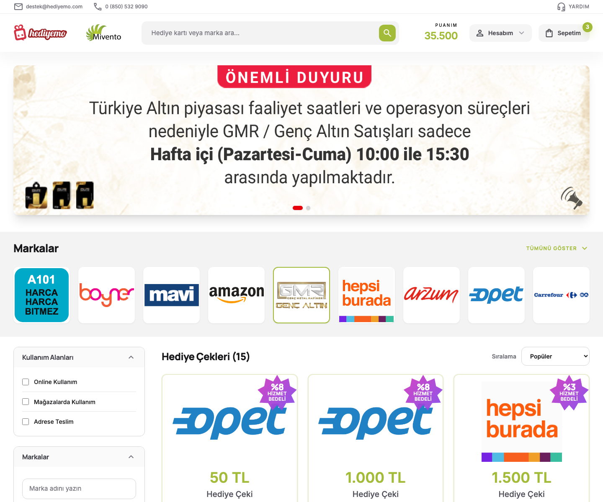
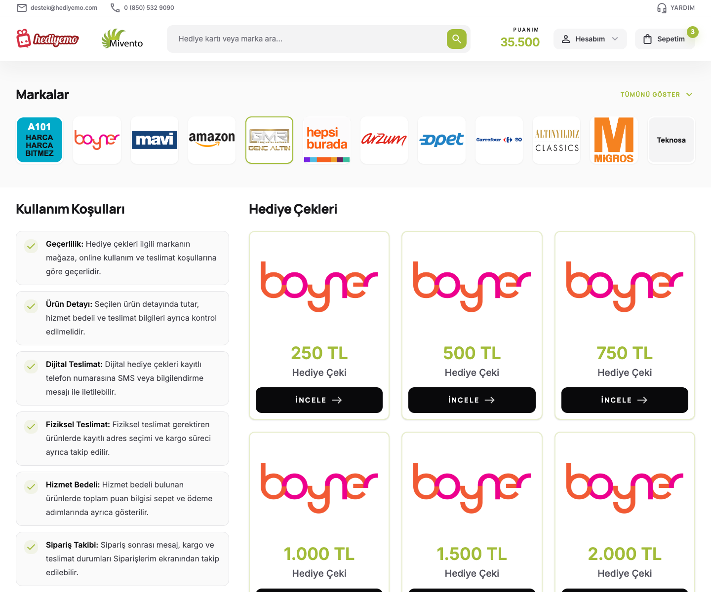
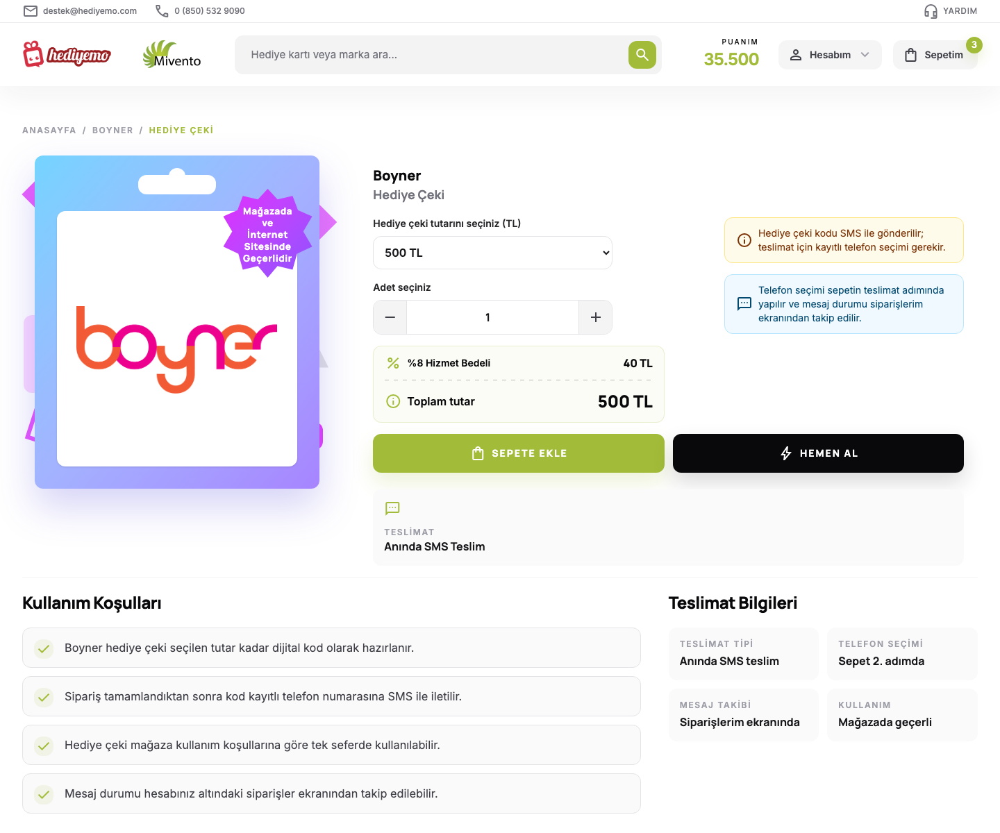
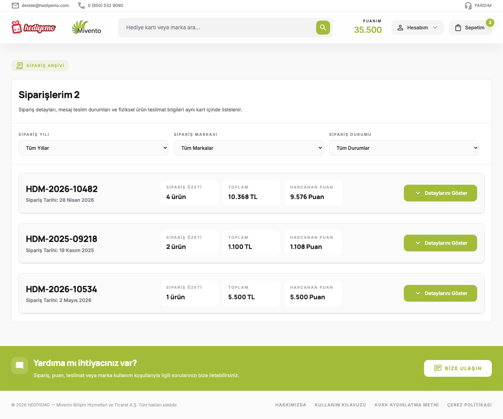
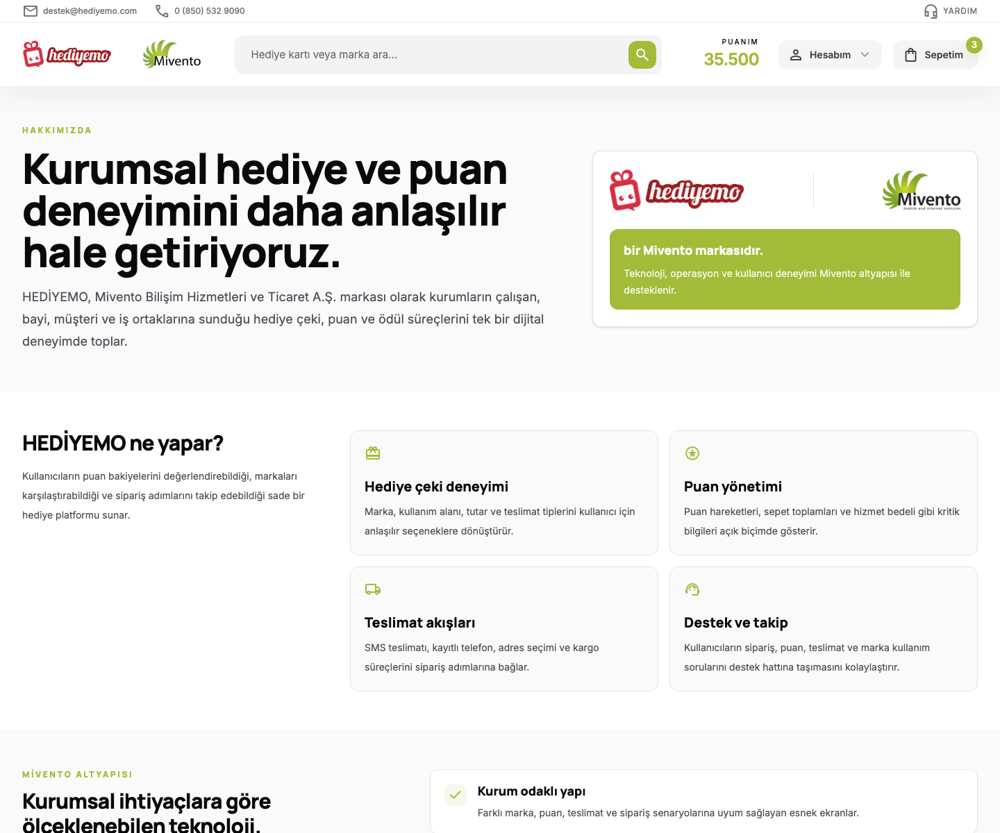
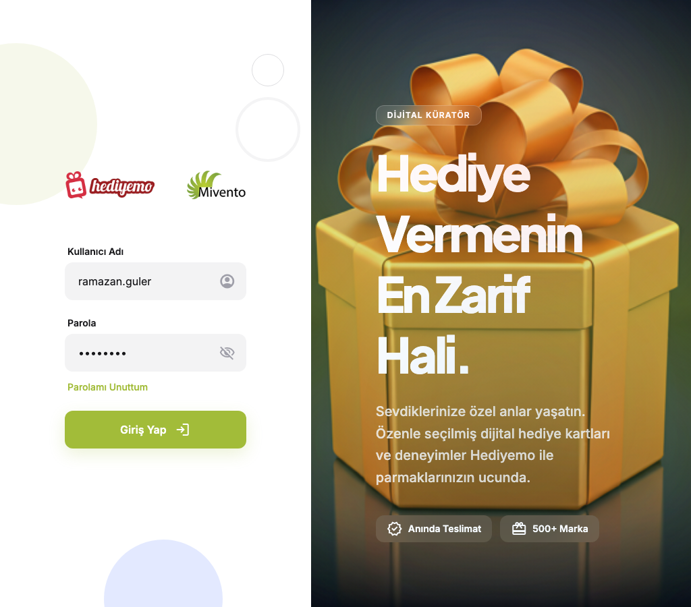
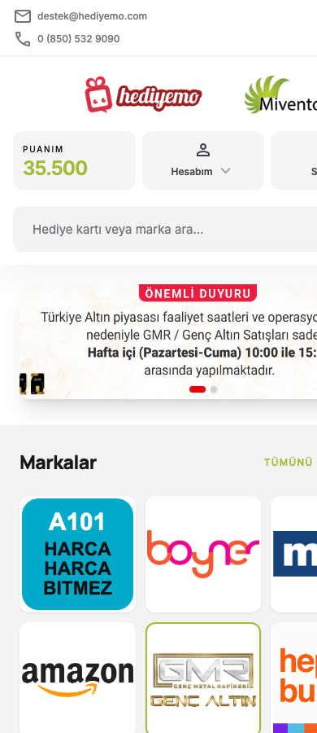
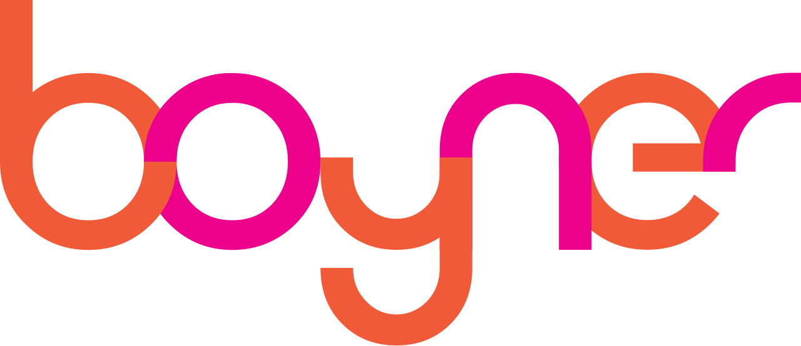

# HEDİYEMO HTML Arayüz Paketi

HEDİYEMO, Mivento Bilişim Hizmetleri ve Ticaret A.Ş. markası altında kurgulanmış statik HTML, Tailwind 4, ortak CSS ve sayfa bazlı JavaScript yapısına sahip bir hediye çeki / puan / sipariş deneyimi arayüz paketidir.

Bu repository; ana listeleme ekranı, marka sayfası, ürün detayları, sepet adımları, sipariş ve hesap ekranları, guest giriş akışları ve proje içi dokümantasyon sayfasını içerir. Proje backend bağımlılığı olmadan statik olarak açılabilir; etkileşimli alanlar sayfa bazlı JavaScript ve `shared.js` üzerinden yönetilir.

---

## İçindekiler

- [Ekran Görüntüleri](#ekran-görüntüleri)
- [Proje Özeti](#proje-özeti)
- [Hızlı Başlangıç](#hızlı-başlangıç)
- [Dosya Yapısı](#dosya-yapısı)
- [Sayfalar](#sayfalar)
- [Tasarım Sistemi](#tasarım-sistemi)
- [CSS Mimarisi](#css-mimarisi)
- [JavaScript Mimarisi](#javascript-mimarisi)
- [Ortak Bileşenler](#ortak-bileşenler)
- [Yeni Sayfa Ekleme Standardı](#yeni-sayfa-ekleme-standardı)
- [Görsel ve Asset Kullanımı](#görsel-ve-asset-kullanımı)
- [Responsive Davranış](#responsive-davranış)
- [Erişilebilirlik Notları](#erişilebilirlik-notları)
- [Bakım ve QA Checklist](#bakım-ve-qa-checklist)
- [Ekran Görüntüsü Alma](#ekran-görüntüsü-alma)

---

## Ekran Görüntüleri

Ekran görüntüleri `assets/readme/` klasörü altında saklanır ve README içinde göreli yollarla kullanılır.

### Ana Sayfa



### Markalar Sayfası



### Ürün Detay: Hediye Çeki



### Siparişlerim



### Hakkımızda



### Login



### Mobil Ana Sayfa



---

## Proje Özeti

Bu proje, HEDİYEMO kullanıcı arayüzünün statik HTML sürümüdür. Ana kullanım senaryoları şunlardır:

- Hediye çeki ve altın ürünlerini listeleme.
- Marka, kategori, kullanım alanı ve bakiye uygunluğu filtreleriyle ürün arama.
- Ürün detayında tutar, adet, hizmet bedeli ve toplam tutar seçimi.
- Sepet offcanvas ve sepet adımlarını görüntüleme.
- Teslimat bilgisi, sipariş onayı ve sipariş geçmişi ekranları.
- Hesap bilgileri, kayıtlı adres ve kayıtlı telefon yönetimi.
- Login, OTP doğrulama ve guest akışları.
- Yardım, Bize Ulaşın offcanvas ve politika panelleri.
- Proje içi referans dokümantasyonu.

Proje bir SPA değildir. Her sayfa ayrı HTML dosyasıdır. Ortak görsel dil `tailwind-config.css`, `shared.css` ve `shared.js` ile korunur.

---

## Hızlı Başlangıç

Projeyi doğrudan HTML dosyalarını açarak inceleyebilirsiniz. Tailwind browser CDN kullanıldığı için en sağlıklı yöntem küçük bir yerel sunucu açmaktır.

```bash
python3 -m http.server 8765 --bind 127.0.0.1
```

Sonra tarayıcıda açın:

```text
http://127.0.0.1:8765/index.html
```

Önemli sayfalar:

```text
http://127.0.0.1:8765/index.html
http://127.0.0.1:8765/markalar.html
http://127.0.0.1:8765/urun-hediye.html
http://127.0.0.1:8765/urun-altin.html
http://127.0.0.1:8765/sepet.html
http://127.0.0.1:8765/siparislerim.html
http://127.0.0.1:8765/hakkimizda.html
http://127.0.0.1:8765/login.html
```

---

## Dosya Yapısı

```text
.
├── assets/
│   ├── banners/              # Ana sayfa banner görselleri
│   ├── brands/               # Marka logoları
│   ├── readme/               # README ekran görüntüleri
│   ├── hediyemo.png
│   ├── mivento.png
│   └── header-reference.png
├── page-js/                  # Sayfa bazlı davranışlar
├── page-css/                 # Eski / ayrıştırılmış sayfa CSS alanı
├── shared.css                # Normal sayfaların ortak CSS katmanı
├── shared-guest.css          # Guest sayfaların ortak CSS katmanı
├── shared.js                 # Ortak header, offcanvas, policy ve ürün detay davranışları
├── tailwind-config.css       # Tailwind 4 tokenları ve proje renk merkezi
├── doc.html                  # Proje içi component/dokümantasyon sayfası
└── *.html                    # Statik sayfalar
```

---

## Sayfalar

| Dosya | Amaç | CSS Standardı | JS |
| --- | --- | --- | --- |
| `index.html` | Ana sayfa, slider, marka vitrini, filtreler, hediye çeki listesi | `shared.css` | `page-js/index.js`, `shared.js` |
| `markalar.html` | Marka odaklı listeleme ve kullanım koşulları | `shared.css` | `page-js/markalar.js`, `shared.js` |
| `hakkimizda.html` | HEDİYEMO ve Mivento marka anlatımı | `shared.css` | `shared.js` |
| `urun-hediye.html` | Hediye çeki ürün detayı | `shared.css` | `page-js/urun-hediye.js`, `shared.js` |
| `urun-altin.html` | Altın ürün detayı | `shared.css` | `page-js/urun-altin.js`, `shared.js` |
| `sepet.html` | Sepet özeti | `shared.css` | `page-js/sepet.js`, `shared.js` |
| `sepet-teslimat.html` | Teslimat bilgileri | `shared.css` | `page-js/sepet-teslimat.js`, `shared.js` |
| `sepet-onay.html` | Sipariş onay ekranı | `shared.css` | `page-js/sepet-onay.js`, `shared.js` |
| `siparislerim.html` | Sipariş geçmişi ve detay offcanvas | `shared.css` | `page-js/siparislerim.js`, `shared.js` |
| `puan-hareketlerim.html` | Puan hareketleri | `shared.css` | `page-js/puan-hareketlerim.js`, `shared.js` |
| `bilgilerim.html` | Hesap bilgileri ve parola güncelleme | `shared.css` | `page-js/bilgilerim.js`, `shared.js` |
| `kayitli-adreslerim.html` | Kayıtlı adres yönetimi | `shared.css` | `page-js/kayitli-adreslerim.js`, `shared.js` |
| `kayitli-telefonlarim.html` | Kayıtlı telefon yönetimi | `shared.css` | `page-js/kayitli-telefonlarim.js`, `shared.js` |
| `yardım.html` | Yardım ve kullanım koşulları içerikleri | `shared.css` | `page-js/yardım.js`, `shared.js` |
| `login.html` | Kullanıcı girişi | `shared-guest.css` | `page-js/login.js`, `shared.js` |
| `verify-otp.html` | OTP doğrulama | `shared-guest.css` | `page-js/verify-otp.js`, `shared.js` |
| `cuzdanlar.html` | Guest cüzdan seçimi / bağlantılı giriş akışı | `shared-guest.css` | `page-js/cuzdanlar.js`, `shared.js` |
| `doc.html` | Proje dokümantasyonu ve component kataloğu | inline doc stilleri + `shared.css` | dokümana özel inline davranışlar |

---

## Tasarım Sistemi

### Ana Renk Merkezi

Proje rengini değiştirmek için ana dosya:

```text
tailwind-config.css
```

İlk bakılması gereken tokenlar:

```css
:root {
  --hdm-color-primary: #a2bc39;
  --hdm-color-primary-container: #a2bc39;
  --hdm-color-primary-fixed: #a2bc39;
  --hdm-color-primary-fixed-dim: #a2bc39;
  --hdm-color-inverse-primary: #a2bc39;
  --hdm-color-search-button-icon: #ffffff;
}
```

Bu tokenlar Tailwind 4 `@theme inline` alanına bağlanır. Sayfalarda doğrudan hex renk yazmak yerine şu utility classlar tercih edilir:

```html
<button class="rounded-xl bg-primary-container text-white">Sepete Ekle</button>
<span class="text-primary">35.500</span>
<div class="border-primary/25 bg-surface-container-lowest"></div>
```

### Radius Standardı

Projede genel border radius standardı:

```text
rounded-xl = 0.75rem
```

Özellikle şu alanlarda `rounded-xl` standardı korunur:

- Header arama kutusu.
- Hesabım ve Sepetim butonları.
- Kartlar.
- Form inputları.
- Offcanvas kartları.
- Select ve checkbox alanları.
- CTA ve ana butonlar.

### Fontlar

Proje font fallback zinciri `tailwind-config.css` içindedir:

```css
--hdm-font-system: system-ui, -apple-system, BlinkMacSystemFont, "Segoe UI", Roboto, Arial, sans-serif;
--hdm-font-headline: "Plus Jakarta Sans", "Manrope", var(--hdm-font-system);
--hdm-font-body: "Inter", var(--hdm-font-system);
```

Google Fonts bağlantısı çoğu sayfada `Manrope` ve `Inter` için yer alır. Bağlantı yüklenmezse sistem fontları devreye girer.

---

## CSS Mimarisi

### `tailwind-config.css`

Bu dosya:

- Proje renk tokenlarını tanımlar.
- Tailwind 4 `@theme inline` eşleşmelerini içerir.
- Browser CDN ile eksik kalabilecek custom utility fallbacklerini sağlar.
- Font, radius ve renk aliaslarını tek merkezde toplar.

### `shared.css`

Normal kullanıcı sayfalarının ortak UI katmanıdır. Şu alanları kapsar:

- Header ve footer destek stilleri.
- Form focus ve input davranışları.
- Filtre kartları ve checkbox listeleri.
- Marka accordion yapısı.
- Hediye çeki kartları.
- Ribbon çeşitleri.
- Ürün detay kartı ve ürün görseli.
- Sipariş, adres, telefon ve hesap kartları.
- Offcanvas ve modal destekleri.

Doğrudan marka rengi değiştirmek için bu dosya kullanılmamalıdır. Renkler `tailwind-config.css` tokenlarına bağlı kalmalıdır.

### `shared-guest.css`

Guest sayfalar için ayrılmıştır:

- `login.html`
- `verify-otp.html`
- `cuzdanlar.html`

Bu sayfalarda normal üye sayfalarının yoğun header/footer düzeni yoktur. Guest ekranlar daha sade giriş akışı odaklıdır.

---

## JavaScript Mimarisi

### `shared.js`

Ortak davranışların tek merkezidir. İçindeki ana fonksiyonlar:

| Fonksiyon | Sorumluluk |
| --- | --- |
| `initAccountMenu` | Header Hesabım dropdown davranışı |
| `initSlidePanel` | Sepet ve Bize Ulaşın offcanvas panelleri |
| `initPolicyPanel` | Hakkımızda dışındaki policy içerikleri için sağ panel |
| `initProductDetailControls` | Ürün detay tutar/adet/toplam/hizmet bedeli davranışı |
| `initBrandAccordion` | Marka accordion aç/kapat davranışı |
| `initChatTabsAndFaq` | Bize Ulaşın form/Yardım tabları ve FAQ accordion |

Ortak davranışlar sayfa JS dosyalarına kopyalanmamalıdır.

### Sayfa Bazlı JS

`page-js/` içindeki dosyalar sadece ilgili sayfanın özel davranışlarını taşır.

Örnekler:

- `page-js/index.js`: ana sayfa ürün datası, filtreler, mobil filtre offcanvas, slider.
- `page-js/markalar.js`: markalar sayfası ürün kartları.
- `page-js/siparislerim.js`: sipariş detayları ve detay offcanvas içerikleri.
- `page-js/login.js`: guest giriş ekranı özel davranışı.

Yeni bir sayfa özel davranışa ihtiyaç duymuyorsa sayfa JS dosyası oluşturulmaz.

---

## Ortak Bileşenler

### Header

Normal sayfalarda header şu alanları içerir:

- İletişim üst barı.
- Logo.
- Arama kutusu.
- Puanım.
- Hesabım dropdown.
- Sepetim offcanvas tetikleyici.

Header arama butonu proje rengine bağlıdır:

```html
<button class="rounded-xl bg-primary-container text-search-button-icon">
  <span class="material-symbols-outlined">search</span>
</button>
```

### Footer

Footer CTA ve menü yapısı tüm normal sayfalarda ortaktır.

Footer telif metni:

```text
© 2026 HEDİYEMO — Mivento Bilişim Hizmetleri ve Ticaret A.Ş. Tüm hakları saklıdır.
```

Footer menüleri:

- Hakkımızda: `hakkimizda.html` sayfasına gider.
- Kullanım Kılavuzu: policy paneli açar.
- KVKK Aydınlatma Metni: policy paneli açar.
- Çerez Politikası: policy paneli açar.

### Sepet Offcanvas

Sepet tüm normal sayfalarda aynı temel yapıda olmalıdır:

```html
<button id="cartButton" aria-expanded="false">Sepetim</button>
<div id="cartModal" aria-hidden="true">
  <div id="cartModalPanel">
    ...
    <button data-cart-close>Kapat</button>
  </div>
</div>
```

Davranış `shared.js` içinde `initSlidePanel` ile bağlanır.

### Bize Ulaşın Offcanvas

Bize Ulaşın panelinde iki tab vardır:

- Bize Ulaşın: form.
- Yardım: FAQ accordion.

FAQ accordion davranışı:

- Varsayılan kapalıdır.
- Bir soru açılınca diğerleri kapanır.

### Policy Panel

Policy paneli `data-policy-trigger` ve `data-policy-type` ile açılır:

```html
<button data-policy-trigger data-policy-type="clarification">
  KVKK Aydınlatma Metni
</button>
```

İçerikler `shared.js` içinde `copy` objesinde tutulur.

### Hediye Çeki Kartları

Kart standardı:

- `rounded-xl`
- Border proje rengiyle hafif karışım.
- Ana aksiyon butonu siyah, hover durumunda proje rengi.
- Mobilde farklı ribbon varyasyonları kullanılabilir.

### Ribbonlar

Projede kullanılan ribbon türleri:

- Burst/star hizmet bedeli.
- Mobil corner ribbon.
- Status pill.
- Circle badge.
- Ürün detay sayfasında geçerlilik ribbonu.

Ribbonlar taşma riski yüksek bileşenlerdir. Mobil ve desktop ayrı kontrol edilmelidir.

---

## Yeni Sayfa Ekleme Standardı

Yeni normal sayfa için önerilen prompt:

```text
Bu projede yeni [sayfa-adi].html sayfasi olustur.
Header/footer/shared offcanvas yapisini mevcut normal sayfalardan al.
Sayfaya ozel CSS yazma; gerekirse shared.css standardini kullan.
Sayfaya ozel JS gerekiyorsa page-js/[sayfa-adi].js icinde sadece sayfaya ozel davranis olsun.
Rounded-xl, Tailwind 4 ve proje renk tokenlarina uy.
```

Yeni guest sayfa için:

```text
Bu projede yeni [sayfa-adi].html sayfasi olustur.
Sayfaya ozel CSS yazma; gerekirse shared-guest.css standardini kullan.
Sayfaya ozel JS gerekiyorsa page-js/[sayfa-adi].js icinde sadece sayfaya ozel davranis olsun.
login standartlarını takip et.
Rounded-xl, Tailwind 4 ve proje renk tokenlarina uy.
```

Yeni sayfa eklerken:

1. Normal sayfaysa `shared.css` kullan.
2. Guest sayfaysa `shared-guest.css` kullan.
3. Ortak header/footer/offcanvas kodunu güncel normal sayfalardan al.
4. Gereksiz sayfa JS dosyası oluşturma.
5. Sayfa JS gerekiyorsa sadece o sayfanın state ve etkileşimini yaz.
6. Proje rengi için hex yazma, token utility kullan.
7. Mobile ve desktop screenshot kontrolü yap.

---

## Görsel ve Asset Kullanımı

### Klasörler

```text
assets/brands/   # Marka logoları
assets/banners/  # Slider ve banner görselleri
assets/readme/   # README ekran görüntüleri
```

### Logo Kullanımı

Marka logolarında:

- Görsel oranı korunmalı.
- `object-contain` kullanılmalı.
- Kart içinde taşma olmamalı.
- Mobilde max-height değerleri ayrıca kontrol edilmeli.

Örnek:

```html

```

### Banner Kullanımı

Ana sayfa slider görselleri:

- Geniş ekranda yaklaşık `1920x500` kompozisyon mantığına uygun olmalı.
- Mobilde metin taşmamalı.
- Indicator renkleri aktif/pasif olarak ayrışmalı.

### README Görselleri

README görselleri:

```text
assets/readme/01-home.png
assets/readme/02-brands.png
assets/readme/03-product-gift.png
assets/readme/04-orders.png
assets/readme/05-about.png
assets/readme/06-login.png
assets/readme/07-home-mobile.png
```

---

## Responsive Davranış

Proje genel kırılımları Tailwind utilityleriyle yönetilir.

Öne çıkan kurallar:

- Mobilde ana sayfa filtreleri daha kompakt görünür.
- Ürün detay sayfalarında ürün kartı ve seçenek alanı alt alta gelir.
- Header arama, puan, hesap ve sepet alanları mobilde grid mantığına iner.
- Markalar alanında mobil grid farklı davranır.
- Offcanvas paneller mobilde tam genişlik, desktopta yaklaşık yüzde 40 genişliktedir.

Kontrol edilmesi gereken viewportlar:

```text
390x900    # mobil
768x1024   # tablet
1440x1200  # desktop
```

---

## Erişilebilirlik Notları

Projede dikkat edilen standartlar:

- Offcanvas paneller `aria-hidden` ile yönetilir.
- Açma butonlarında `aria-expanded` kullanılır.
- Modal/panel kapanış butonlarında `aria-label` vardır.
- Focus trap davranışı `shared.js` içinde desteklenir.
- `Escape` ile panel kapatma desteklenir.
- `details/summary` yapıları native klavye desteği sağlar.

Yeni bileşen eklerken:

- İkon-only butonlarda `aria-label` kullan.
- Görsellerde anlamlı `alt` metni yaz.
- Form label ve input ilişkisini koru.
- Focus görünürlüğünü tamamen kaldırma.
- Tıklanabilir elemanlarda cursor pointer davranışını koru.

---

## Bakım ve QA Checklist

Yeni değişiklikten sonra aşağıdakileri kontrol edin:

### Genel

- [ ] `rounded-xl` standardı korunuyor mu?
- [ ] Proje rengi tokenlardan mı geliyor?
- [ ] Gereksiz inline style eklendi mi?
- [ ] Sayfaya özel CSS yazıldıysa gerçekten gerekli mi?
- [ ] Ortak davranış `shared.js` yerine sayfa JS dosyasına kopyalandı mı?

### Header / Footer

- [ ] Header arama butonu proje renginde mi?
- [ ] Hesabım ve Sepetim radiusları tutarlı mı?
- [ ] Footer CTA proje renginde mi?
- [ ] Footer menüleri tüm normal sayfalarda aynı mı?
- [ ] Bize Ulaşın offcanvas tüm sayfalarda aynı mı?

### Ürün Kartları

- [ ] Kart border rengi proje rengiyle uyumlu mu?
- [ ] İncele butonu siyah ve hover proje rengi mi?
- [ ] Ribbon mobilde logoyu kapatmıyor mu?
- [ ] Kart paddingleri mobilde taşma yapmıyor mu?

### Ürün Detay

- [ ] Tutar seçimi ve adet inputu çalışıyor mu?
- [ ] Toplam tutar doğru güncelleniyor mu?
- [ ] Hizmet bedeli gösterimi doğru mu?
- [ ] Mobilde ürün görseli taşmıyor mu?

### Sepet / Sipariş

- [ ] Sepet offcanvas tüm sayfalarda aynı mı?
- [ ] Kaldır butonları kırmızı mı?
- [ ] Alışverişi Tamamla butonu proje renginde mi?
- [ ] Sipariş detay offcanvas kartları `rounded-xl` mi?

### Guest Sayfalar

- [ ] `shared-guest.css` kullanılıyor mu?
- [ ] Login ve verify-otp arka plan şekilleri proje rengine bağlı mı?
- [ ] Input ve buton focus durumları görünür mü?

---

## Ekran Görüntüsü Alma

Bu README’deki görseller Chrome headless ile alındı. Yerel sunucu:

```bash
python3 -m http.server 8765 --bind 127.0.0.1
```

Örnek ekran görüntüsü komutu:

```bash
"/Applications/Google Chrome.app/Contents/MacOS/Google Chrome" \
  --headless=new \
  --disable-gpu \
  --no-sandbox \
  --hide-scrollbars \
  --window-size=1440,1200 \
  --screenshot=assets/readme/01-home.png \
  http://127.0.0.1:8765/index.html
```

Mobil örnek:

```bash
"/Applications/Google Chrome.app/Contents/MacOS/Google Chrome" \
  --headless=new \
  --disable-gpu \
  --no-sandbox \
  --hide-scrollbars \
  --window-size=390,900 \
  --screenshot=assets/readme/07-home-mobile.png \
  http://127.0.0.1:8765/index.html
```

Not: Chrome headless bazı sistemlerde arka plan servislerini geç kapatabilir. Gerekirse komutu timeout wrapper ile çalıştırın.

---

## Bilinen Teknik Notlar

- Tailwind 4 browser CDN ile yüklenir. Offline kullanım istenirse Tailwind çıktısı local build sürecine alınmalıdır.
- Google Fonts yüklenmezse sistem font fallbackleri devreye girer.
- `doc.html` proje içi referans sayfasıdır; normal kullanıcı akışının parçası gibi düşünülmemelidir.
- `page-css/` klasörü geçmiş ayrıştırma çalışmalarından kalmış olabilir; aktif kullanım için HTML linkleri kontrol edilmelidir.
- Ortak offcanvas ve policy davranışları `shared.js` üzerinden yürür.
- `hakkimizda.html` sayfasında özel JS yoktur; yalnızca `shared.js` kullanır.

---

## Marka Notu

Footer metni:

```text
© 2026 HEDİYEMO — Mivento Bilişim Hizmetleri ve Ticaret A.Ş. Tüm hakları saklıdır.
```

HEDİYEMO marka adı görünür metinlerde büyük yazım standardıyla kullanılabilir. E-posta adresi ve URL gibi teknik alanlarda küçük yazım korunur.

